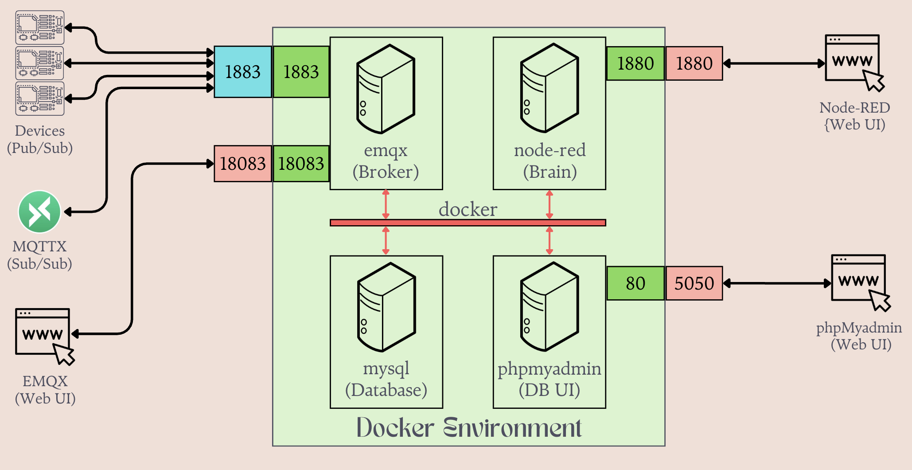

# IoT Stack — Docker Environment

A four-service Docker Compose stack for collecting, processing, and storing IoT sensor data from ESP32 devices, with an optional Grafana service for metrics dashboards.



---

## Services

| Container | Image | Role |
|---|---|---|
| `emqx` | `emqx/emqx:6.2.0-gbc8c29b2` | MQTT broker — entry point for all sensor data from IoT devices |
| `node-red` | `nodered/node-red:4.1.10-22-minimal` | Flow engine — subscribes to MQTT topics and writes to MySQL |
| `mysql` | `mysql:9.7.0` | Relational database — stores sensor readings |
| `phpmyadmin` | `phpmyadmin:5.2.3` | Web UI for MySQL — browse and query sensor data |
| `grafana` *(disabled)* | `grafana/grafana:nightly-slim` | Metrics dashboard — visualises data from MySQL / other sources |

> **Note:** `grafana` is commented out in `docker-compose.yml` (disabled due to low disk space on host). Uncomment the service block and the `grafana_data` volume to re-enable it.

### Start-up Order

```
emqx → node-red
mysql → phpmyadmin
mysql → grafana (disabled)
```

---

## Ports

| Port (host) | Service | Protocol | Purpose |
|---|---|---|---|
| `1883` | emqx | MQTT | Plain MQTT — IoT devices publish here |
| `8083` | emqx | WS | MQTT over WebSocket |
| `8883` | emqx | MQTTS | MQTT over SSL/TLS |
| `8084` | emqx | WSS | MQTT over WebSocket SSL |
| `18083` | emqx | HTTP | EMQX Dashboard |
| `1880` | node-red | HTTP | Node-RED Editor |
| `3306` | mysql | TCP | MySQL — direct database access |
| `5050` | phpmyadmin | HTTP | phpMyAdmin |
| `3000` | grafana | HTTP | Grafana Dashboard *(disabled — see [Services](#services))* |

### Web UIs

| Interface | URL | Default credentials |
|---|---|---|
| EMQX Dashboard | http://localhost:18083 | `admin` / `admin` |
| Node-RED Editor | http://localhost:1880 | none — set `adminAuth` in `settings.js` to enable |
| phpMyAdmin | http://localhost:5050 | `admin` / `admin` |
| Grafana Dashboard *(disabled)* | http://localhost:3000 | `admin` / `admin` |

> **Note:** MySQL credentials — root password: `admin`, app user: `admin` / `admin`, database: `db`.

### Public Access (Reverse Proxy)

phpMyAdmin (and Grafana, once enabled) can be served behind an nginx reverse proxy under a sub-path instead of a raw port. Uncomment and set the relevant env vars in `docker-compose.yml`:

- phpmyadmin: `PMA_ABSOLUTE_URI: https://<domain.name>/phpmyadmin/`
- grafana: `GF_SERVER_ROOT_URL` and `GF_SERVER_SERVE_FROM_SUB_PATH: true`

---

## Quick Start

```bash
# Start all services in the background
docker compose up -d

# Verify all containers are running
docker compose ps

# Tail logs from all services
docker compose logs -f

# Stop (data volumes preserved)
docker compose down

# Stop and wipe all data volumes
docker compose down -v
```

---

## Data Flow

```
IoT Device (ESP32)
    │  publish → topic e.g. home/sensor/temp
    ▼  port 1883
  emqx  (MQTT Broker)
    │  deliver message to subscribers
    ▼  internal: emqx:1883
  node-red  (Flow Automation)
    │  parse payload → INSERT INTO db
    ▼  internal: mysql:3306
  mysql  (Database)
    │
    ├──▼  phpmyadmin  (DB UI) — http://localhost:5050
    │
    └──▼  grafana  (Metrics UI, disabled) — http://localhost:3000
```

---

## Volumes

Data is stored in named Docker volumes managed by the Docker engine. Volumes persist across restarts and container re-creation.

| Volume | Service | Container path |
|---|---|---|
| `emqx_data` | emqx | `/opt/emqx/data` |
| `emqx_log` | emqx | `/opt/emqx/log` |
| `node_red_data` | node-red | `/data` |
| `mysql_data` | mysql | `/var/lib/mysql` |
| `grafana_data` *(disabled)* | grafana | `/var/lib/grafana` |

## Network

All services share a single bridge network named `docker`. Containers reach each other by service name (e.g. `mysql:3306`, `emqx:1883`) without needing IP addresses.
